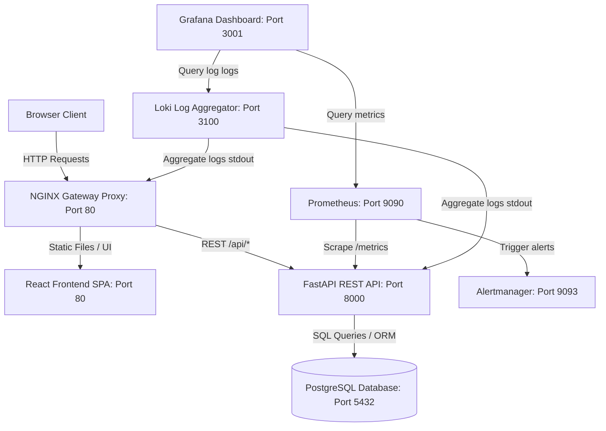
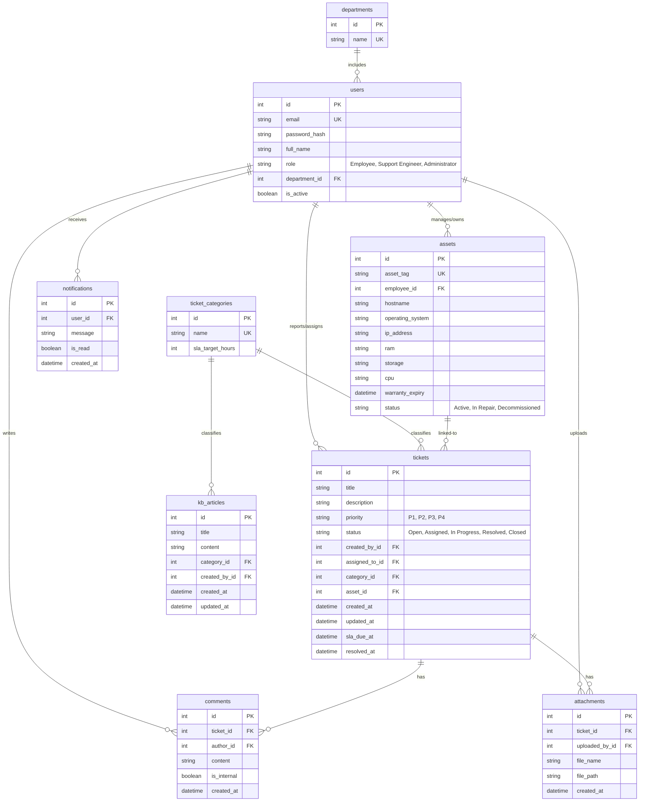

# SupportSphere – Enterprise IT Service Desk & Incident Management Platform

SupportSphere is a production-ready, full-stack enterprise IT Service Desk and Incident Management Platform. Designed to mirror real-world systems like ServiceNow and Jira Service Management, it provides employees, support engineers, and administrators with role-based features to handle IT incidents, track specifications of hardware assets, review service level agreements (SLAs), search documentation repositories, and monitor server environments.

---

## 🏗️ Architecture Diagram

Below is the platform architecture showing network proxying, data storage, and the monitoring sidecar stack:



---

## 📊 Entity Relationship (ER) Diagram

The normalized relational database schema mapped via SQLAlchemy ORM is shown below:



---

## 🔗 REST API Documentation

The backend exposes a fully documented OpenAPI REST API (available at `/docs` when running).

### 🔐 Authentication
* **POST `/api/auth/login`**: Authenticate and return a Bearer JWT Token.
  * *Request Body*: `{"email": "...", "password": "..."}`
  * *Response*: `{"access_token": "...", "token_type": "bearer"}`
* **GET `/api/auth/me`**: Get currently authenticated user details.
  * *Headers*: `Authorization: Bearer <token>`

### 🎫 Incidents & Tickets
* **GET `/api/tickets`**: Fetch tickets (filtered automatically by permissions).
* **POST `/api/tickets`**: Create ticket. Calculates dynamic SLA based on category limit and priority.
* **GET `/api/tickets/{ticket_id}`**: Retrieve detailed incident details.
* **PUT `/api/tickets/{ticket_id}`**: Modify properties (status transitions, assignment).
* **POST `/api/tickets/{ticket_id}/comments`**: Append discussion notes (internal or public).
* **POST `/api/tickets/{ticket_id}/attachments`**: Upload incident attachments (`multipart/form-data`).

### 💻 Assets & Inventory
* **GET `/api/assets`**: List assets. Employees only see their own; staff see full registry.
* **POST `/api/assets`**: Register corporate hardware (Admin only).
* **PUT `/api/assets/{asset_id}`**: Update specifications/owners (Admin & Support only).
* **DELETE `/api/assets/{asset_id}`**: Remove asset (Admin only).

### 📈 Analytics Metrics
* **GET `/api/analytics/summary`**: Retrieve platform statistics (SLA breach rate, open count, averages, engineer scores).

---

## 🐳 Docker Deployment Guide

The stack is containerized for simple sandbox setup.

### Prerequisites
* Docker and Docker Compose installed.

### Execution
1. Navigate to root directory:
   ```bash
   cd SupportSphere
   ```
2. Build and launch all services:
   ```bash
   docker-compose up --build
   ```
3. Access services:
   * **NGINX Gateway Portal (Frontend SPA & API)**: [http://localhost](http://localhost)
   * **Prometheus Targets**: [http://localhost:9090](http://localhost:9090)
   * **Grafana Dashboards**: [http://localhost:3001](http://localhost:3001) (Credentials: `admin` / `admin`)
   * **Loki Endpoint**: [http://localhost:3100](http://localhost:3100)
   * **Alertmanager Console**: [http://localhost:9093](http://localhost:9093)

### Pinned Demo Accounts
* **Administrator**: `admin@supportsphere.com` / `AdminSphere2026!`
* **Support Engineer**: `engineer@supportsphere.com` / `EngineerSphere2026!`
* **Employee**: `employee@supportsphere.com` / `EmployeeSphere2026!`

---

## ☸️ Kubernetes Deployment Guide

Enterprise grade configurations are placed under the `kubernetes/` folder.

### Components
1. **Namespace (`namespace.yaml`)**: Allocates isolated logical scope `supportsphere`.
2. **Secrets & ConfigMaps (`secrets.yaml`, `configmaps.yaml`)**: Configuration values and Base64 encrypted credentials.
3. **Database Persistent Volume (`pvc.yaml`)**: 10Gi volume mapping Postgres database folder.
4. **Deployments & Services (`postgres-deployment.yaml`, `backend-deployment.yaml`, `frontend-deployment.yaml`)**: Mapped container images, environment bindings, readiness/liveness health probes.
5. **Ingress Gateway (`ingress.yaml`)**: Routes `/api` to the backend cluster service and `/` to the frontend cluster service.
6. **Autoscaling (`hpa.yaml`)**: CPU target thresholds scaling backend pods up to 10 instances.

### Application Deploy
```bash
kubectl apply -f kubernetes/namespace.yaml
kubectl apply -f kubernetes/secrets.yaml
kubectl apply -f kubernetes/configmaps.yaml
kubectl apply -f kubernetes/pvc.yaml
kubectl apply -f kubernetes/postgres-deployment.yaml
kubectl apply -f kubernetes/backend-deployment.yaml
kubectl apply -f kubernetes/frontend-deployment.yaml
kubectl apply -f kubernetes/ingress.yaml
kubectl apply -f kubernetes/hpa.yaml
```

---

## 🚀 GitHub Actions CI/CD Pipeline

The YAML workflow in `.github/workflows/ci-cd.yml` automates verification and push steps:
1. **Unit Testing**: Launches Python 3.12 runner, installs requirements, sets `TESTING=True` env, runs backend `pytest` suite.
2. **Compile Checks**: Runs Node.js runner, installs npm dependencies, and runs `npm run build` validating type safety.
3. **Docker Build & Push**: Builds production-optimized container images and pushes to GitHub Container Registry (GHCR) tagged with commit hashes.
4. **Kubernetes Rollout**: Updates active cluster deployments using `azure/k8s-set-context` and triggers rollouts.

---

## 🔧 Troubleshooting Guide

### 1. Database Connection Failures
* **Symptom**: `sqlalchemy.exc.OperationalError: Connection refused`.
* **Fix**: Ensure the database service container is running and healthy. On Docker Compose, check health status using `docker-compose ps`. Ensure postgres port `5432` is not occupied system-wide.

### 2. Passlib / Bcrypt ValueError Long Password Crash
* **Symptom**: `ValueError: password cannot be longer than 72 bytes`.
* **Fix**: This happens due to a passlib package bug checking password wrap lengths with newer bcrypt libraries. Pin `bcrypt==3.2.0` in `requirements.txt` to solve.

### 3. Kubernetes Pod Crashes (CrashLoopBackOff)
* **Symptom**: Pod fails to reach ready state.
* **Fix**: Check logs using `kubectl logs <pod-name> -n supportsphere`. Ensure ConfigMaps/Secrets are fully loaded before deploying. Verify PostgreSQL connectivity status.
